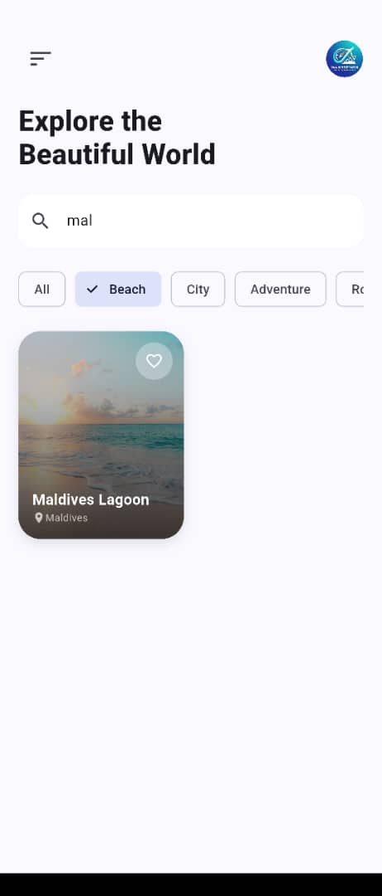
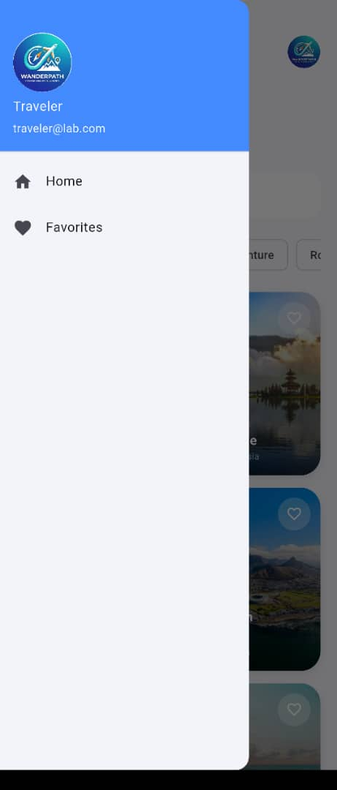
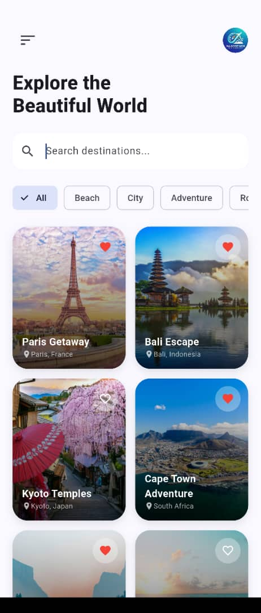

# Travel Explorer

 Flutter UI lab — advanced layout composition & navigation with hard-coded data.

---

## Navigation Flow

```
Home  →  Detail  →  Booking  →  Confirmation  →  ↩ Home
```

---

## Preview

| Home Dashboard | Search & Filters | Drawer |
|:-:|:-:|:-:|
| ![Home]** | ![Search]** | ![Drawer]** |

| Detail Screen | Favorites | Booking |
|:-:|:-:|:-:|
| ![Detail]** | ![Favorites]** | ![Booking]** |

---

## Features

**Search & Filter**
Real-time filtering over hard-coded list. Category tabs (`Beach`, `City`, `Adventure`) via `ChoiceChip`.

**Favorites**
Stateful heart toggle per card — outline → filled red. Persists within session.

**Layouts**
- `Home` — `Stack` + `GridView` with gradient overlays
- `Detail` — `SliverAppBar` collapsible header + custom info chips
- `Booking` — `Form` with traveler counter + `AlertDialog` confirmation

---

## Widget Audit `18+`

| Category | Widgets |
|---|---|
| Layout | `Scaffold` `SafeArea` `Stack` `Positioned` `Column` `Row` `Expanded` `SizedBox` |
| Scroll | `CustomScrollView` `SliverAppBar` `FlexibleSpaceBar` |
| Lists | `GridView.builder` `ListView.builder` |
| Components | `Card` `Drawer` `ChoiceChip` `CircleAvatar` `TextField` `ElevatedButton` |
| Interaction | `GestureDetector` `Form` `TextFormField` `AlertDialog` |
| Animation | `Hero` |

---

## Design System

```
Typography  — Bold headers / grey-toned metadata
Depth       — BoxShadow elevation + LinearGradient overlays
Layout      — MediaQuery + SafeArea for notch/aspect compatibility
```

---

## Structure

```
lib/
├── data/        # Hard-coded models & static list
├── screens/     # Home · Detail · Booking
├── widgets/     # DestinationCard · InfoTile (reusable)
└── main.dart    # Entry point & theme
```

---

## Setup

```bash
flutter pub get
flutter run
```


---

## Lab Notes

| Concern | Approach |
|---|---|
| Data | All content lives in `travel_data.dart` |
| Navigation | `Navigator.push()` / `.pop()` |
| Architecture | Reusable widget classes — DRY by design |

---

## Students

| # | Name | Reg No |
|---|---|---|
| 1 | UWIZEYIMANA Gaetan |222008181|
| 2 | NIYONIZERA Aline| 223009117 |